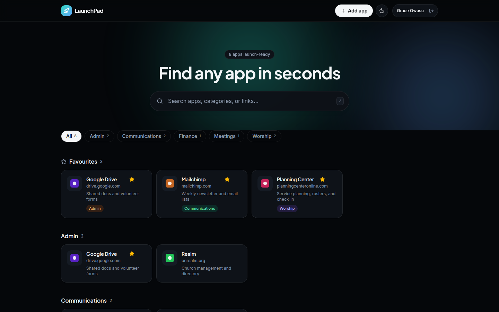
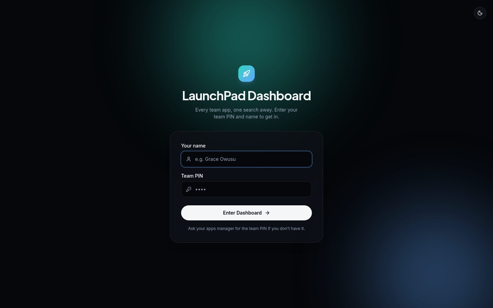
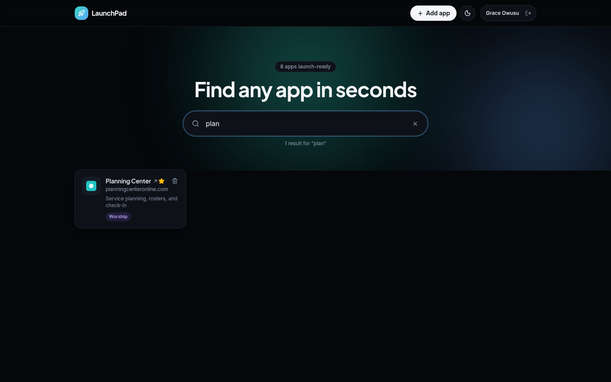
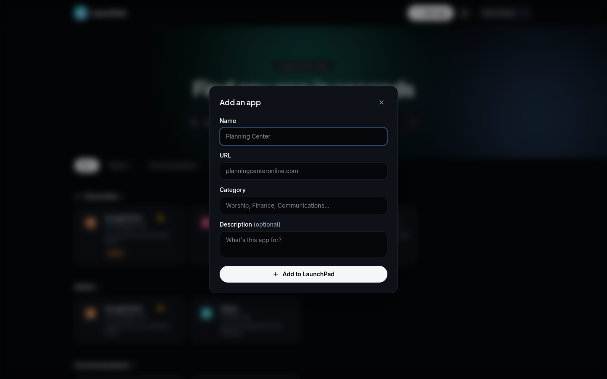
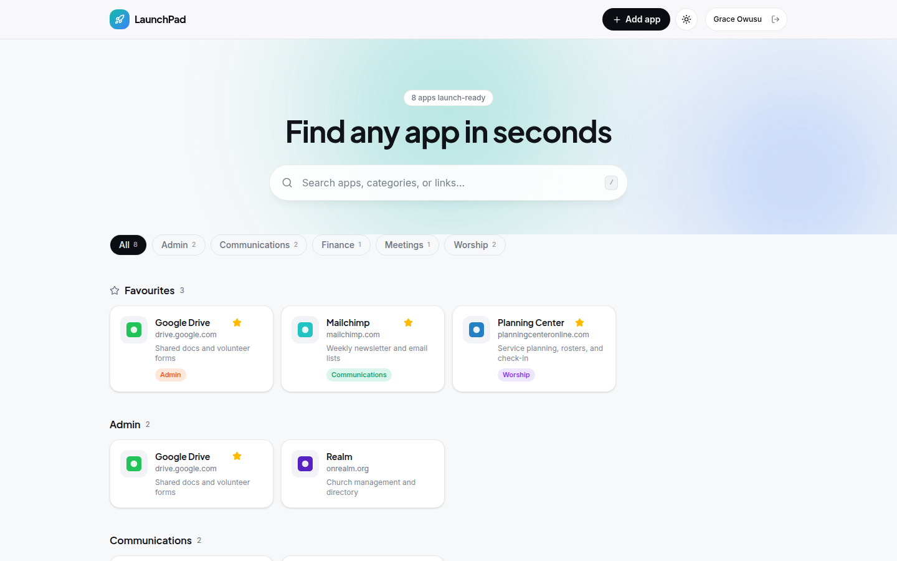

# 🚀 LaunchPad Dashboard

**Every app your team uses — one search away.**

No more digging through bookmarks, Slack threads, and sticky notes to find
the right link. LaunchPad is a single shared dashboard your whole team signs
into: search instantly, browse by category, star your favourites, and pick
up right where you left off on any device.

<p align="center">
  
</p>

---

## ✨ What you get

| | |
|---|---|
| 🔍 **Instant search** | Filters by name, category, description, and URL as you type. Press `/` anywhere to jump into the search box. |
| 🗂️ **Category browsing** | Apps are grouped and filterable with one click — no digging through a flat list. |
| ⭐ **Favourites & recents** | Synced per person through Redis, so they follow you from your laptop to your phone. |
| 🤝 **Shared catalog** | Anyone signed in can add an app — the whole team keeps it current together. |
| 🌗 **Dark / light mode** | Follows system preference by default, one click to switch. |
| 🔑 **One shared team PIN** | No accounts to manage. Enter the PIN once per device, then your name tags your favourites. |
| ⚡ **Smooth by default** | Animated cards, modals, and transitions throughout — built with Framer Motion. |

## 📸 A closer look

<table>
<tr>
<td width="50%">

<p align="center"><sub>Sign in with your name + the shared team PIN</sub></p>
</td>
<td width="50%">

<p align="center"><sub>Instant search, filtered as you type</sub></p>
</td>
</tr>
<tr>
<td width="50%">

<p align="center"><sub>Add an app in seconds — anyone on the team can</sub></p>
</td>
<td width="50%">

<p align="center"><sub>Light mode, if that's more your team's style</sub></p>
</td>
</tr>
</table>

## 🛠️ Tech stack

- **[Next.js](https://nextjs.org)** (App Router) + TypeScript
- **[Upstash Redis](https://upstash.com)** — stores the app catalog plus per-person favourites/recents, synced across devices
- **[Tailwind CSS](https://tailwindcss.com)** + **[Framer Motion](https://motion.dev)** for the look and feel
- **[Vercel](https://vercel.com)** for hosting

## 🚦 Getting started

### 1. Get a Redis database

Either works — pick whichever is easier for you:

- **New database:** create one free at [console.upstash.com](https://console.upstash.com), then open the **REST API** tab and copy the URL + token.
- **Already have a Vercel KV / Upstash store:** you can reuse it — see the **Deploying to Vercel** section below.

### 2. Configure your environment

```bash
cp .env.example .env.local
```

Fill in `.env.local`:

| Variable | What it is |
|---|---|
| `UPSTASH_REDIS_REST_URL` | From your Upstash database's REST API tab |
| `UPSTASH_REDIS_REST_TOKEN` | From your Upstash database's REST API tab |
| `TEAM_PIN` | Whatever PIN you want your team to type in to get in |
| `SESSION_SECRET` | A long random string — generate with `openssl rand -base64 32` |

### 3. Run it

```bash
npm install
npm run dev
```

Open [http://localhost:3000](http://localhost:3000), enter the team PIN and your name, and start adding apps.

## ☁️ Deploying to Vercel

1. Import this repository at [vercel.com/new](https://vercel.com/new).
2. Connect a Redis store:
   - **Already have an Upstash/Vercel KV database?** Open the project's **Storage** tab and connect it. Vercel injects `KV_REST_API_URL` / `KV_REST_API_TOKEN` automatically — LaunchPad reads those as a fallback, so nothing to rename.
   - **Starting fresh?** Add `UPSTASH_REDIS_REST_URL` and `UPSTASH_REDIS_REST_TOKEN` under **Settings → Environment Variables** yourself.
3. Also add, under **Settings → Environment Variables**:
   - `TEAM_PIN`
   - `SESSION_SECRET` (`openssl rand -base64 32`)
4. Deploy — or **redeploy** if you added the variables after the first build.

Upstash Redis is HTTP-based and serverless-friendly, so there's no extra networking setup needed for Vercel to reach it.

## 💡 Notes for the apps manager

- Anyone signed in can add or remove an app from the shared catalog — that's intentional, so the whole team can keep it current.
- Favourites and recents are personal, keyed by name — ask everyone to enter their name the same way each time (case matters).
- To rotate the team PIN, change `TEAM_PIN` and redeploy. Everyone signs in again with the new PIN, but existing apps, favourites, and recents are untouched.
